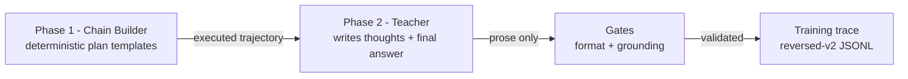

# LatticeAG ForgeDistill 🔨

<p align="center">
  <a href="LICENSE">
    
  </a>
  <a href="https://github.com/LatticeAG/ForgeDistill/actions">
    
  </a>
  <a href="https://github.com/LatticeAG/ForgeDistill/stargazers">
    
  </a>
  <a href="https://github.com/LatticeAG/ForgeDistill/issues">
    
  </a>
  <a href="https://github.com/LatticeAG/ForgeDistill">
    
  </a>
  <a href="https://img.shields.io/badge/Python-3.11+-blue?style=for-the-badge&logo=python" alt="Python">
    
  </a>
</p>

<p align="center">
  <b>Correctness-by-construction distillation for agentic tool-calling models.</b><br/>
  The tool-call chains are guaranteed correct before a single teacher token is spent.
</p>

<p align="center">
  <a href="#why-this-exists">Why This Exists</a> ·
  <a href="#how-it-works">How It Works</a> ·
  <a href="#quick-start">Quick Start</a> ·
  <a href="#dataset-format">Dataset Format</a> ·
  <a href="#verification">Verification</a>
</p>

---

ForgeDistill (part of the LatticeAG **Forge** series - distillation, training, and models) is an open-source
harness for generating high-structure training data for **agentic tool-calling models** - multi-turn,
sequentially dependent tool calls with real error-recovery - using any teacher model, weak or strong.

Most distillation frameworks ask a teacher to *demonstrate* correct agentic behavior. Most models can't do
that reliably, which is why so much synthetic agentic data has shallow one-call trajectories and
fabricated values. ForgeDistill inverts the problem: the structure is built deterministically, the teacher
only writes prose.

Built by [LatticeAG](https://github.com/LatticeAG).

## Why This Exists

| Framework | Approach | Weakness |
|---|---|---|
| distilabel (Argilla) | General-purpose pipeline framework | No built-in correctness guarantees - you write your own steps |
| APIGen / xLAM (Salesforce) | Post-hoc 3-stage verification | Verifies *after* generation, still throws away garbage, needs frontier teachers |
| Glaive function-calling | Generator-trusted, mostly single-turn | No dependency enforcement |
| AgentInstruct (Microsoft) | Multi-agent flows | No tool-dependency correctness |

**The differentiator: correctness by construction + grounding gates.**

1. We build the tool-call chain **deterministically** with real, unskippable dependencies - e.g. `send_email(to="$0.result.email")` where the address is an opaque value only obtainable by calling a prior tool. Guessing fails with a 400.
2. The teacher is used **only for prose** (thoughts + final answer), never for tool calls - malformed JSON is impossible.
3. Semantic grounding gates reject final answers that fabricate values not present in the real tool results.

Result: structurally-perfect, prose-grounded training traces from *any* OpenAI-compatible teacher endpoint.

## How It Works



**Phase 1 - deterministic chain construction (zero teacher tokens).** `agentic_plans.py` picks a plan template
(multi_hop, branch, recovery, join, fanout, reorder, digest, schema, idempotent, disambiguate, stop), fills
variables, resolves `$S.result` references against prior step results, and executes against a deterministic
mock executor. Sequential dependencies are unskippable by construction:

- `send_email(to="$0.result.email")` - the teacher cannot guess the opaque address (e.g. `carol.y.9024@internal.corp`); it must come from a prior `get_user` result
- `db_query(...WHERE plan = '$0.result.plan')` - the exact plan string must be learned from the user profile
- Error-recovery plans deliberately fail the first step (bad id / bad city), then correct - teaching the observe-error-and-retry loop

**Phase 2 - teacher prose (the only teacher spend).** The teacher receives the full execution record (prompt +
every call + exact results) and writes ONLY:

- N `<thought>` blocks (reasoning before each call, including recovery thoughts)
- `FINAL_ANSWER:` grounded in the real tool results

The harness assembles the final trace with its own validated tool calls. Weak models can do this; strong
models do it better - both produce structurally-correct data.

## Quick Start

```bash
# 1. Clone and set up
git clone https://github.com/LatticeAG/ForgeDistill.git
cd ForgeDistill
python3 -m venv .venv && source .venv/bin/activate
pip install -r requirements.txt

# 2. Configure your teacher fleet (any OpenAI-compatible endpoints)
cp configs/roster.example.yaml configs/roster.yaml
#    - set base_url / key_env per provider
#    - export your keys, e.g. export MY_PROVIDER_KEY=sk-...

# 3. Sanity check the modules
python -c "import sys; sys.path.insert(0,'src'); import distill_tools, agentic_plans, prose_writer; print('OK')"

# 4. Pilot run (10 traces)
ulimit -n 65536
python src/distill_tools.py --count 10 --pilot

# 5. Audit the output on disk (don't trust stdout)
cat data/raw/traces_*.jsonl | python -m json.tool --json-lines | head -20
```

Generated traces land in `data/raw/traces_<provider>.jsonl`. The harness refuses to overwrite existing data -
use `src/archive_data.py` to archive runs (it never deletes).

## Dataset Format

Reversed-v2 format - each JSONL line:

```json
{
  "seed_class": "agentic",
  "prompt": "...user prompt...",
  "teacher": "provider/model",
  "teacher_mode": "thinking|concise",
  "plan_id": "plan_<template_id>",
  "distill_version": "reversed-v2",
  "messages": [
    {"role": "system", "content": "..."},
    {"role": "user", "content": "..."},
    {"role": "assistant", "content": "<thought>...</thought>\n<tool_call>[{\"name\": ..., \"arguments\": {...}}]</tool_call>"},
    {"role": "tool", "content": "{\"status\": 200, \"result\": {...}}"},
    {"role": "assistant", "content": "final answer..."}
  ]
}
```

- Assistant turns: thought + exact tool call (deterministic, validated JSON)
- Tool turns: real executor results (success or error payloads)
- No artificial "provide the final answer" nudge in exported messages
- Final answer must contain key facts from the last successful tool result (grounding gate)

## Verification

```bash
# 300-chain stress test: build_chain + validate_chain x 300, expect 0 invalid
python - <<'EOF'
import sys, random; sys.path.insert(0, 'src')
from agentic_plans import build_chain, validate_chain
rng = random.Random(0)
bad = sum(1 for _ in range(300) if validate_chain(build_chain(rng)['steps']))
print(f"invalid chains: {bad}/300")
EOF
```

Independent audit results (2026-08-13):

- 300-chain stress test: **300/300 valid, 0 invalid**
- 10-trace pilot through the real worker path: **10/10 passed** format + grounding gates
- 100% multi-round (2x2, 6x3, 2x4 rounds), 0 malformed tool calls, 0 unique-prompt collisions
- All `send_email` calls used in-context learned emails (28/28 in the pilot) - real dependency learning

## Features

| Category | Feature |
|---|---|
| Structure | 29 plan templates across 11 skill tags (multi_hop, branch, recovery, join, fanout, reorder, digest, schema, idempotent, disambiguate, stop) |
| Dependencies | `$S.result.field` refs create unskippable sequential dependencies |
| Recovery | Deliberate failure + correction plans teach observe-error-and-retry |
| Grounding | Semantic gate rejects fabricated values in final answers |
| Teacher-agnostic | Any OpenAI-compatible endpoint - works with weak and strong models |
| Resilience | Per-provider health state machine (healthy / backoff / quarantined), 429 quarantine, Retry-After honoring, exponential backoff with jitter |
| Fleet management | Per-provider semaphores, concurrency scaling, weighted model sampling, dead-route re-probing |
| Robustness | Trajectory-hash dedup, checkpoint/resume per provider, per-worker RNG, token accounting |
| Safety | Never overwrites existing data; archive-before-run; refuses `--wipe` unless explicit |

## Repository Layout

```
src/agentic_plans.py     Phase 1: deterministic chain builder + plan templates + mock executor
src/prose_writer.py      Phase 2: teacher prose contract + format/grounding validators + trace assembly
src/distill_tools.py     Async worker loop: fleet health, semaphores, checkpointing, CLI
src/mock_tools.py        Shared deterministic tool executor (get_user, send_email, db_query, weather, file_exists)
src/archive_data.py      Archive data/raw to data/archive/<timestamp>_<label>/ - never deletes
safe_launch.sh           Archive-first launcher with raised fd limit
configs/roster.example.yaml  Teacher fleet config template (copy to roster.yaml: endpoints, models, weights)
```

## License

Released under the [MIT License](LICENSE). Built by [LatticeAG](https://github.com/LatticeAG).