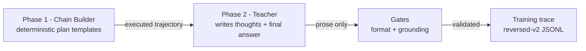

# LatticeAG ForgeDistill 🔨

<p align="center">
  <a href="LICENSE">
    
  </a>
  <a href="https://github.com/LatticeAG/ForgeDistill/actions">
    
  </a>
  <a href="https://github.com/LatticeAG/ForgeDistill/stargazers">
    
  </a>
  <a href="https://github.com/LatticeAG/ForgeDistill/issues">
    
  </a>
  <a href="https://github.com/LatticeAG/ForgeDistill">
    
  </a>
  <a href="https://img.shields.io/badge/Python-3.11+-blue?style=for-the-badge&logo=python" alt="Python">
    
  </a>
</p>

<p align="center">
  <b>Correctness-by-construction distillation for agentic tool-calling models.</b><br/>
  The tool-call chains are guaranteed correct before a single teacher token is spent.
</p>

<p align="center">
  <a href="#why-this-exists">Why This Exists</a> ·
  <a href="#how-it-works">How It Works</a> ·
  <a href="#quick-start">Quick Start</a> ·
  <a href="#dataset-format">Dataset Format</a> ·
  <a href="#verification">Verification</a>
</p>

---

ForgeDistill (part of the LatticeAG **Forge** series - distillation, training, and models) is an open-source
harness for generating high-structure training data for **agentic tool-calling models** - multi-turn,
sequentially dependent tool calls with real error-recovery - using any teacher model, weak or strong.

Most distillation frameworks ask a teacher to *demonstrate* correct agentic behavior. Most models can't do
that reliably, which is why so much synthetic agentic data has shallow one-call trajectories and
fabricated values. ForgeDistill inverts the problem: the structure is built deterministically, the teacher
only writes prose.

Built by [LatticeAG](https://github.com/LatticeAG).

## Why This Exists

| Framework | Approach | Weakness |
|---|---|---|
| distilabel (Argilla) | General-purpose pipeline framework | No built-in correctness guarantees - you write your own steps |
| APIGen / xLAM (Salesforce) | Post-hoc 3-stage verification | Verifies *after* generation, still throws away garbage, needs frontier teachers |
| Glaive function-calling | Generator-trusted, mostly single-turn | No dependency enforcement |
| AgentInstruct (Microsoft) | Multi-agent flows | No tool-dependency correctness |

**The differentiator: correctness by construction + grounding gates.**

1. We build the tool-call chain **deterministically** with real, unskippable dependencies - e.g. `send_email(to="$0.result.email")` where the address is an opaque value only obtainable by calling a prior tool. Guessing fails with a 400.
2. The teacher is used **only for prose** (thoughts + final answer), never for tool calls - malformed JSON is impossible.
3. Semantic grounding gates reject final answers that fabricate values not present in the real tool results.

Result: structurally-perfect, prose-grounded training traces from *any* OpenAI-compatible teacher endpoint.

## How It Works



**Phase 1 - deterministic chain construction (zero teacher tokens).** `agentic_plans.py` picks a plan template
(multi_hop, branch, recovery, join, fanout, reorder, digest, schema, idempotent, disambiguate, stop), fills
variables, resolves `$S.result` references against prior step results, and executes against a deterministic
mock executor. Sequential dependencies are unskippable by construction:

- `send_email(to="$0.result.email")` - the teacher cannot guess the opaque address (e.g. `carol.y.9024@internal.corp`); it must come from a prior `get_user` result
- `db_query(...WHERE plan = '$0.result.plan')` - the exact plan string must be learned from the user profile
- Error-recovery plans deliberately fail the first step (bad id / bad city), then correct - teaching the observe-error-and-retry loop

**Phase 2 - teacher prose (the only teacher spend).** The teacher receives the full execution record (prompt +
every call + exact results) and writes ONLY:

- N `<thought>` blocks (reasoning before each call, including recovery thoughts)
- `FINAL_ANSWER:` grounded in the real tool results

The harness assembles the final trace with its own validated tool calls. Weak models can do this; strong
models do it better - both produce structurally-correct data.

## Quick Start

```bash
# 1. Clone and set up
git clone https://github.com/LatticeAG/ForgeDistill.git
cd ForgeDistill
python3 -m venv .venv && source .venv/bin/activate
pip install -e ".[dev]"

# 2. Configure your multi-provider OpenAI-compatible roster (any OpenAI-compatible endpoints)
cp configs/roster.example.yaml configs/roster.yaml
#    - set base_url / key_env per provider
#    - export your keys, e.g. export MY_PROVIDER_KEY=sk-...

# 3. Sanity check the modules (no sys.path hacks after install)
python -c "import distill_tools, agentic_plans, prose_writer; print('OK')"

# 4. Pilot run (10 traces)
ulimit -n 65536
python src/distill_tools.py --count 10 --pilot
# or the installed console script:
distill --count 10 --pilot

# 5. Audit the output on disk (don't trust stdout)
cat data/raw/traces_*.jsonl | python -m json.tool --json-lines | head -20
```

After `pip install -e ".[dev]"`, both forms work: `python src/X.py` for direct scripts and console entry points `distill`, `eval_card`, and `export_sft` for documented commands.

Generated traces land in `data/raw/traces_<provider>.jsonl`. The harness refuses to overwrite existing data -
use `src/archive_data.py` to archive runs (it never deletes).

## Dataset Format

Reversed-v2 format - each JSONL line:

```json
{
  "seed_class": "agentic",
  "prompt": "...user prompt...",
  "teacher": "provider/model",
  "teacher_mode": "thinking|concise",
  "plan_id": "plan_<template_id>",
  "distill_version": "reversed-v2",
  "forge_spec": "0.2",
  "plan_tier": "easy",
  "chain_steps": [
    {"tool": "get_user", "args": {"user_id": 123}, "result": {"status": 200, "result": {...}}, "expect": "success"}
  ],
  "eval": {
    "format_ok": true,
    "grounding_ok": true,
    "chain_ok": true,
    "dependency_ok": true,
    "n_rounds": 2,
    "n_tool_calls": 2,
    "skills": ["multi_hop", "stop"],
    "tier": "easy",
    "repaired": false,
    "cross_teacher": false
  },
  "messages": [
    {"role": "system", "content": "..."},
    {"role": "user", "content": "..."},
    {"role": "assistant", "content": "<thought>...</thought>\n<tool_call>[{\"name\": ..., \"arguments\": {...}}]</tool_call>"},
    {"role": "tool", "content": "{\"status\": 200, \"result\": {...}}"},
    {"role": "assistant", "content": "final answer..."}
  ]
}
```

- Assistant turns: thought + exact tool call (deterministic, validated JSON)
- Tool turns: real executor results (success or error payloads)
- No artificial "provide the final answer" nudge in exported messages
- Final answer must contain key facts from the last successful tool result (grounding gate)

## Verification

CI runs `pytest -q` on Python 3.11.

300-chain stress test (also stored as `eval_card.json` `commands.stress_300`):

```bash
python -c "import sys,random; sys.path.insert(0,'src'); from agentic_plans import build_chain, validate_chain; r=random.Random(0); print(sum(1 for _ in range(300) if validate_chain(build_chain(r)['steps'])))"
```

### Dataset (structural) audit

Latest measured run: **500 traces**, multi-provider teacher fleet, `reversed-v2`.

```bash
python src/eval_card.py --input data/raw --out data/raw/eval_card.json --require-gates
```

| Metric | Source path | Value |
|---|---|---|
| Trace count | `n_traces` | **500** |
| Prose gate pass rate | `gates.validate_prose_trace_pass` | **1.0** |
| Grounding gate pass rate | `gates.validate_answer_grounding_pass` | **1.0** |
| Chain gate pass rate | `gates.validate_chain_pass` | **1.0** |
| Dependency fidelity pass rate | `gates.dependency_fidelity_pass` | **1.0** |
| Nudge leak rate | `gates.nudge_leak_rate` | **0.0** |
| Malformed tool-call rate | `gates.malformed_tool_call_rate` | **0.0** |
| Multi-round rate | `structure.multi_round_rate` | **0.988** |
| Unique prompt rate | `structure.unique_prompt_rate` | **0.996** |
| Unique trajectory hash rate | `structure.unique_traj_hash_rate` | **1.0** |
| Send-email learned address rate | `structure.send_email_learned_address_rate` | **1.0** |
| Cross-teacher split rate | `structure.cross_teacher_split_rate` | 0.0 (opt-in, off by default) |
| Cross-teacher fallback rate | `structure.cross_teacher_fallback_rate` | 0.0 |
| 300-chain invalid | `commands.stress_300` stdout | **0** (300/300 valid) |
| Plan templates defined | `skills.n_templates_defined` | **47** |
| Skill tags defined | `skills.n_tags_defined` | **15** |
| Easy tier plans | `skills.tier_counts.easy` | 9 |
| Medium tier plans | `skills.tier_counts.medium` | 12 |
| Hard tier plans | `skills.tier_counts.hard` | 21 |
| Expert tier plans | `skills.tier_counts.expert` | 5 |

`--require-gates` exits 0 on this run: prose, grounding, chain, and dependency
fidelity are all 1.0 with zero nudge leaks. Every number above is copied from
`data/raw/eval_card.json` - the file, not a hand-typed claim.

Historical note (2026-08-13, v0.1 pilot, n=10): 10/10 passed format + grounding gates; 100% multi-round; 0 malformed tool calls; 0 unique-prompt collisions; all send_email calls used in-context learned emails.

Plan counts source of truth:

```bash
python -c "from agentic_plans import PLANS, SKILLS; print(len(PLANS), len(SKILLS), sorted(SKILLS))"
```

### Forge Live Tool Eval (student), not BFCL v3

| Category | Score | Command |
|---|---|---|
| multiple | no student checkpoint in this tag | `python src/eval_live.py --endpoint $STUDENT_URL --model $STUDENT_MODEL --holdout data/raw/holdout_plan_ids.json --n 50 --out data/raw/live_eval.json --key-env STUDENT_KEY_ENV` |
| parallel | no student checkpoint in this tag | same as above |
| multi_turn | no student checkpoint in this tag | same as above |
| irrelevance | unscored | same as above |

CI uses `eval_live.py --replay` (ReplayStudent) separately; those scores are not student-checkpoint rows in this table.

## Export quickstart

```bash
python src/export_sft.py \
  --input data/raw \
  --out data/export/nanbeige.jsonl \
  --template configs/templates/nanbeige.json \
  --format messages \
  --check-mask
```

`configs/templates/nanbeige.json` and `configs/templates/chatml.json` set `assistant` `loss: true` and all other roles `loss: false`. `--check-mask` validates message-level assistant-only spans. Token-level `--check-tokenizer` is pending a published `NANBEIGE_TOKENIZER` checkpoint and an optional `transformers` install (not a default dependency); do not claim tokenizer verification until that env is set. The command above writes `data/export/nanbeige.jsonl`; `data/export/mask_audit.txt` records the first 3 `traj_hash` values and per-example trainable-span counts from that run. Do not type span counts by hand.

## Curriculum

`--curriculum {off,uniform,linear}` on `distill`:

- **uniform**: 0.25 weight per tier (easy / medium / hard / expert)
- **linear**: `mix_for_progress` at progress 0: easy 0.50, medium 0.30, hard 0.15, expert 0.05; at progress 1: easy 0.10, medium 0.20, hard 0.40, expert 0.30

`--holdout-frac 0.15` writes `holdout_plan_ids.json` beside traces. Pilots use `--holdout-frac 0`.

Coverage note from `eval_card.COVERAGE_NOTE`: skills.coverage is computed against train_ids only; holdout_plan_ids lists excluded ids so readers can reproduce. Tier coverage assertions in CI run with `--holdout-frac 0` fixtures.

## Features

| Category | Feature |
|---|---|
| Structure | 47 plans, 15 tags: arithmetic, branch, calendar, digest, disambiguate, fanout, idempotent, join, multi_hop, nested, recovery, reorder, schema, search, stop. Tiers: easy 9, medium 12, hard 21, expert 5 |
| Dependencies | `$S.result.field` refs create unskippable sequential dependencies |
| Recovery | Deliberate failure + correction plans teach observe-error-and-retry |
| Grounding | Semantic gate rejects fabricated values in final answers |
| Teacher-agnostic | Multi-provider teacher fleet - any OpenAI-compatible endpoint |
| Resilience | Per-provider health state machine (healthy / backoff / quarantined), 429 quarantine, Retry-After honoring, exponential backoff with jitter |
| Fleet management | Per-provider semaphores, concurrency scaling, weighted model sampling, dead-route re-probing |
| Robustness | Trajectory-hash dedup, checkpoint/resume per provider, per-worker RNG, token accounting |
| Safety | Never overwrites existing data; archive-before-run; refuses `--wipe` unless explicit |
| Curriculum | `--curriculum {off,uniform,linear}` tier mixing |
| Export | `export_sft.py` renders SFT jsonl with assistant-only loss masks |
| DPO | `dpo_pairs.py` offline preference pairs from assembled traces |
| Eval card | `eval_card.py --require-gates` structural audit json |
| Live hook | `eval_live.py` Forge Live Tool Eval (ReplayStudent in CI) |

## Repository Layout

```
src/agentic_plans.py     Phase 1: deterministic chain builder + plan templates + mock executor
src/prose_writer.py      Phase 2: teacher prose contract + format/grounding validators + trace assembly
src/distill_tools.py     Async worker loop: fleet health, semaphores, checkpointing, CLI
src/mock_tools.py        Shared deterministic tool executor (11 tools)
src/archive_data.py      Archive data/raw to data/archive/<timestamp>_<label>/ - never deletes
src/eval_card.py         Structural eval card json from traces_*.jsonl
src/export_sft.py        SFT export with template-driven loss masks
src/eval_live.py         Forge Live Tool Eval student hook
src/verifier.py          Optional LLM verifier for prose repair
src/curriculum.py        Tier mix, holdout split, plan picking
src/dpo_pairs.py         Offline DPO pair builder
configs/templates/*.json Chat templates (nanbeige, chatml)
configs/roster.example.yaml  Teacher fleet config template (copy to roster.yaml)
tests/                   pytest suite
.github/workflows/ci.yml CI: editable install, pytest, CLI --help smoke
pyproject.toml           Package metadata and console scripts
safe_launch.sh           Archive-first launcher with raised fd limit
```

## Publishing

Export `HF_TOKEN` for the commands below; do not rely on a cached `huggingface-cli login`; if unset at tag time the upload is a later operator step.

```bash
huggingface-cli upload LatticeAG/ForgeDistill-agentic data/raw/eval_card.json --repo-type dataset
huggingface-cli upload LatticeAG/ForgeDistill-agentic data/export/nanbeige.jsonl --repo-type dataset --path-in-repo sft/nanbeige.jsonl
huggingface-cli upload LatticeAG/ForgeDistill-agentic data/raw/dpo_pairs_offline.jsonl --repo-type dataset --path-in-repo dpo/dpo_pairs.jsonl
```

Include `holdout_plan_ids.json` on the dataset card so the 0.15 holdout split is visible to consumers. Operators may upload it alongside `eval_card.json`:

```bash
huggingface-cli upload LatticeAG/ForgeDistill-agentic data/raw/holdout_plan_ids.json --repo-type dataset
```

Configure teachers via a multi-provider OpenAI-compatible roster (`configs/roster.yaml`); keys live in env vars only.

## Locked design decisions (v0.3)

**search.query.** Intersection over whitespace tokens; hit order is `DOC_BY_QUERY[tokens[0]]`; empty and unknown tokens behave as implemented. Do not change this semantics.

**price.** Price values come from `VAR_POOLS["price"] = [20, 35, 50]`, not a CRM field.

**Opaque ids.** Identifiers such as `evt.*` and `doc.*` may be quoted when they appeared in tool payloads; inventing one fails grounding; students are not required to recite them.

**roles.answer pin.** A roster pin for `roles.answer` wins over sampling; rate still gates whether a split happens; sampling never overrides a valid pin.

**--mp token accounting.** Multiprocess runs write `.token_usage_{shard_i}.json` sidecars merged by the parent; do not publish all-zero token totals on multiprocess runs.

## License

Released under the [MIT License](LICENSE). Built by [LatticeAG](https://github.com/LatticeAG).
